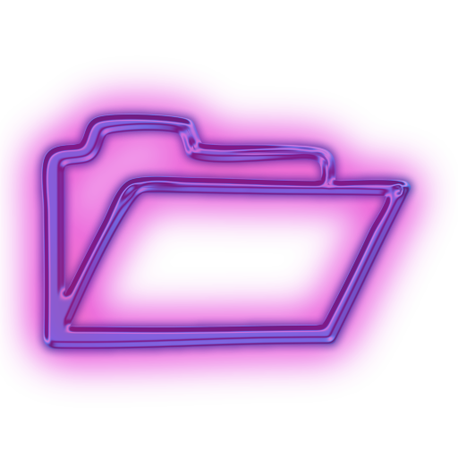

# Development of a method for detecting the orientation of parcels in container unloading processes
### Abstract
On the conveyor belt of an automatic container unloading system, orientation recognition processes must be rapid and accurate in order to retrieve information about the orientation of individual packages. In addition, it is critical to recognize the effects of environmental and parcel-related factors to effectively detect it.

This thesis suggests an algorithm to detect parcel orientation on a conveyor belt in real time, using fast and simple techniques. This algorithm has two stages for the detection process. To obtain parcel orientation results, the suggested technique first identifies the object using a trained YOLOv3 model and then calculates the orientation features with the detection of contours of target features.

For parcel detection on the conveyor belt, the existing YOLOv3 model is trained using both this thesis's own and open source parcel data. The contour-based technique is used to calculate the angle of the parcel's top surface and find the location and direction of arrow marks on parcels to identify the orientation.

This thesis provides consistent orientation information of parcels through real-time detection of parcels by using the rotation angle of parcels and the detection arrow with it's direction. Although the contour-based technique's result shows lower accuracy rate while detecting arrow markers, the detection of parcels model and contour-based angle calculation provides better accuracy rate for detecting parcel orientation.

The orientation detection process, as illustrated in this thesis, is affected by ambient and parcel factors such as lighting, parcel colour, and distance between parcels. It is evidenced by the evaluation of this thesis's algorithm, The bright ambient light improves the accuracy of the orientation outcome. The suggested system detected parcels with a 94\% accuracy,detected angle rotation of parcels with a 92\% accuracy, and detected arrow marks with a 50\% accuracy. The overall accuracy of the method proposed in this thesis is 79\%. The orientation detection technique is affected by the lack of arrow indicators in small and big size boxes, as well as the lack of a handle mechanism.

#### Requirements
To run the orientation detection process, all necessary libraries are list out in requirements text file.
For the installation of this libraries input below command in the iris-parcel-orientation-detection directory terminal.

With pip:
```shell
pip install -r requirements.txt
```
#### Start
To start the open the main_controller.py and run or follow the following steps.
```shell
1. Open the file
2. Development > MainDetection > main_controller.py
3. Right click on the mouse (In pycharm ide) and clck run
```

#### Repository Structure
The structure of repository n divided into the following directory.
- Development (All the necessary method are included to detect the orientation)
- Evaluation (Script to evaluate the algorithm of detection orientation)
- DataTestResults (Data of test and actual image, CSV format data of orientation detection from test)

#### Repository Overview

 DataTestResults <br/>
 &nbsp; &nbsp; &nbsp; FieldTest <br/>
 &nbsp; &nbsp; &nbsp;&nbsp;&nbsp;&nbsp;&nbsp; ActualValuesImage <br/>
 &nbsp; &nbsp; &nbsp;&nbsp;&nbsp;&nbsp;&nbsp; RawData <br/>
 &nbsp; &nbsp; &nbsp;&nbsp;&nbsp;&nbsp;&nbsp; RawImage <br/>
 &nbsp; &nbsp; &nbsp; Labtest <br/>
 &nbsp; &nbsp; &nbsp;&nbsp;&nbsp;&nbsp;&nbsp; ActualValuesImage <br/>
 &nbsp; &nbsp; &nbsp;&nbsp;&nbsp;&nbsp;&nbsp; RawData <br/>
 &nbsp; &nbsp; &nbsp;&nbsp;&nbsp;&nbsp;&nbsp; RawImage <br/>
 &nbsp; &nbsp; &nbsp;&nbsp;&nbsp;&nbsp;&nbsp; Materials <br/>
 Development <br/>
 &nbsp; &nbsp; &nbsp; DetectArrow <br/>
 &nbsp; &nbsp; &nbsp;&nbsp;&nbsp;&nbsp;&nbsp; previous_test <br/>
 &nbsp; &nbsp; &nbsp;&nbsp;&nbsp;&nbsp;&nbsp; arrow_detection_pipeline_final.py <br/>
 &nbsp; &nbsp; &nbsp; DetectOrientation <br/>
 &nbsp; &nbsp; &nbsp;&nbsp;&nbsp;&nbsp;&nbsp; previous_test <br/>
 &nbsp; &nbsp; &nbsp;&nbsp;&nbsp;&nbsp;&nbsp; orientation_detection_pipeline.py <br/>
 &nbsp; &nbsp; &nbsp; ExtractRoi <br/>
 &nbsp; &nbsp; &nbsp;&nbsp;&nbsp;&nbsp;&nbsp; mouse_click_roi.py <br/>
 &nbsp; &nbsp; &nbsp;&nbsp;&nbsp;&nbsp;&nbsp; roi_with_contours.py <br/>
 &nbsp; &nbsp; &nbsp;&nbsp;&nbsp;&nbsp;&nbsp; select_roi_by_default.py<br/>
 &nbsp; &nbsp; &nbsp;&nbsp;&nbsp;&nbsp;&nbsp; select_roi_by_mouse.py<br/>
 &nbsp; &nbsp; &nbsp; ModelTrain <br/>
 &nbsp; &nbsp; &nbsp;&nbsp;&nbsp;&nbsp;&nbsp; yolov3_custom.cfg<br/>
 &nbsp; &nbsp; &nbsp;&nbsp;&nbsp;&nbsp;&nbsp; yolov3_rain_model.ipynb<br/>
 &nbsp; &nbsp; &nbsp;&nbsp;&nbsp;&nbsp;&nbsp; annonate_data.py<br/>
 &nbsp; &nbsp; &nbsp;&nbsp;&nbsp;&nbsp;&nbsp; data_download.py<br/>
 &nbsp; &nbsp; &nbsp;&nbsp;&nbsp;&nbsp;&nbsp; obj.data<br/>
 &nbsp; &nbsp; &nbsp;&nbsp;&nbsp;&nbsp;&nbsp; obj.names<br/>
 &nbsp; &nbsp; &nbsp; MainDetection <br/>
 &nbsp; &nbsp; &nbsp;&nbsp;&nbsp;&nbsp;&nbsp; previous_test <br/>
 &nbsp; &nbsp; &nbsp;&nbsp;&nbsp;&nbsp;&nbsp; camera_serial_number.py <br/>
 &nbsp; &nbsp; &nbsp;&nbsp;&nbsp;&nbsp;&nbsp; data_analysis.py<br/>
 &nbsp; &nbsp; &nbsp;&nbsp;&nbsp;&nbsp;&nbsp; data_read_write.py<br/>
 &nbsp; &nbsp; &nbsp;&nbsp;&nbsp;&nbsp;&nbsp; final_decession.py<br/>
 &nbsp; &nbsp; &nbsp;&nbsp;&nbsp;&nbsp;&nbsp; gui_method.py<br/>
 &nbsp; &nbsp; &nbsp;&nbsp;&nbsp;&nbsp;&nbsp; main_controller.py<br/>
 &nbsp; &nbsp; &nbsp;&nbsp;&nbsp;&nbsp;&nbsp; utils.py<br/>
 &nbsp; &nbsp; &nbsp; PipelineCamera <br/>
 &nbsp; &nbsp; &nbsp;&nbsp;&nbsp;&nbsp;&nbsp; real_sense_camera_frame.py <br/>
 &nbsp; &nbsp; &nbsp; PreviousExperiments <br/>
 &nbsp; &nbsp; &nbsp; YoloModelTrained <br/>
 &nbsp; &nbsp; &nbsp;&nbsp;&nbsp;&nbsp;&nbsp; labels <br/>
 &nbsp; &nbsp; &nbsp;&nbsp;&nbsp;&nbsp;&nbsp; weights <br/>
 &nbsp; &nbsp; &nbsp;&nbsp;&nbsp;&nbsp;&nbsp; batch_norm.py <br/>
 &nbsp; &nbsp; &nbsp; yolov3tf2 <br/>
 &nbsp; &nbsp; &nbsp;&nbsp;&nbsp;&nbsp;&nbsp; fonts <br/>
 &nbsp; &nbsp; &nbsp;&nbsp;&nbsp;&nbsp;&nbsp; labels <br/>
 &nbsp; &nbsp; &nbsp;&nbsp;&nbsp;&nbsp;&nbsp; weights <br/>
 &nbsp; &nbsp; &nbsp;&nbsp;&nbsp;&nbsp;&nbsp; models.py <br/>
 &nbsp; &nbsp; &nbsp;&nbsp;&nbsp;&nbsp;&nbsp; utils.py <br/>
 &nbsp; &nbsp; &nbsp; capture_video.py <br/>


 Evaluation <br/>
 &nbsp; &nbsp; &nbsp; plots_of_field_test <br/>
 &nbsp; &nbsp; &nbsp; plots_of_lab_test <br/>
 &nbsp; &nbsp; &nbsp; plots_utils_field_test <br/>
 &nbsp; &nbsp; &nbsp;&nbsp;&nbsp;&nbsp;&nbsp; all_scripts_for_creat_plot.py<br/>
 &nbsp; &nbsp; &nbsp; plots_utils_lab_test <br/>
 &nbsp; &nbsp; &nbsp;&nbsp;&nbsp;&nbsp;&nbsp; all_scripts_for_creat_plot.py<br/>
 &nbsp; &nbsp; &nbsp; plots_custom_data <br/>
 &nbsp; &nbsp; &nbsp; processed_data_field_test <br/>
 &nbsp; &nbsp; &nbsp; processed_data (lab test) <br/>
 &nbsp; &nbsp; &nbsp; statistical analysis <br/>
 &nbsp; &nbsp; &nbsp;&nbsp;&nbsp;&nbsp;&nbsp; all_scripts_analysis_of_test_data.py<br/>
 &nbsp; &nbsp; &nbsp; statistical data field test <br/>
 &nbsp; &nbsp; &nbsp; statistical data lab test <br/>
 &nbsp; &nbsp; &nbsp; utils <br/>


#### Development Activity Diagram


#### Reference
- https://github.com/IntelRealSense/librealsense/issues/6267 
- https://stackoverflow.com/questions/44579050/how-to-find-the-center-and-angle-of-objects-in-an-image 
- https://github.com/EscVM/OIDv4_ToolKit
- https://github.com/theAIGuysCode/Download-Google-Images
- https://www.youtube.com/watch?v=10joRJt39Ns
- https://www.youtube.com/watch?v=EGQyDla8JNU
- https://github.com/yijingru/BBAVectors-Oriented-Object-Detection
- https://dev.intelrealsense.com/docs/python2 
- https://github.com/topics/3d-object-detection
- https://github.com/GotG/object_detection_demo_flow 
- https://github.com/matterport/Mask_RCNN 

